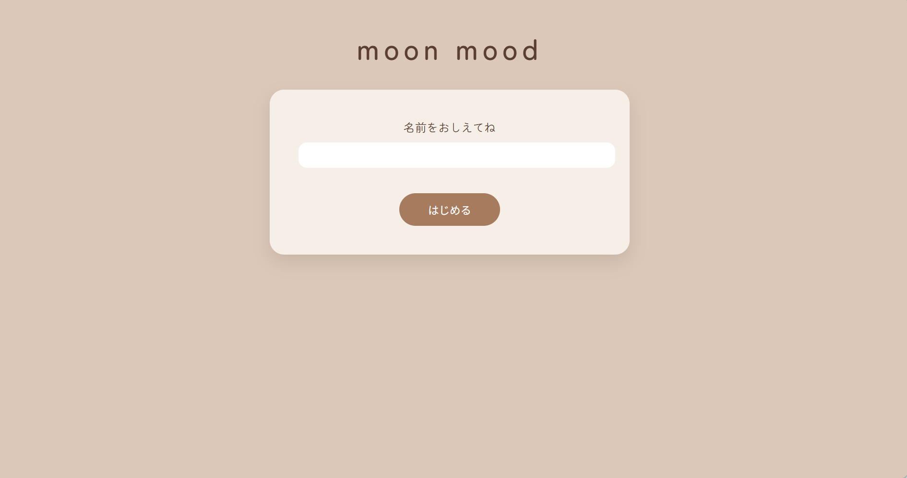
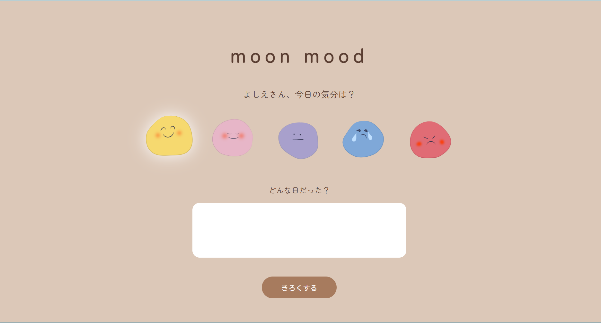
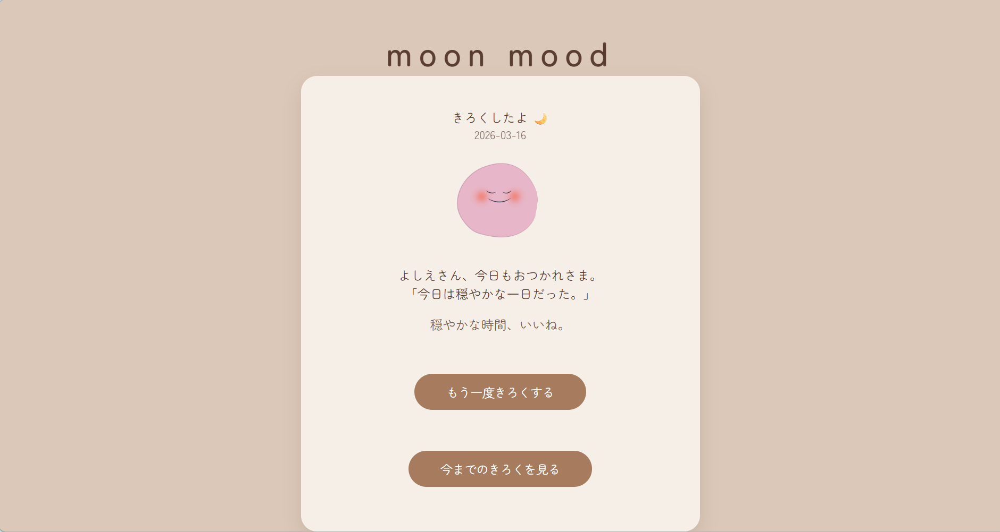
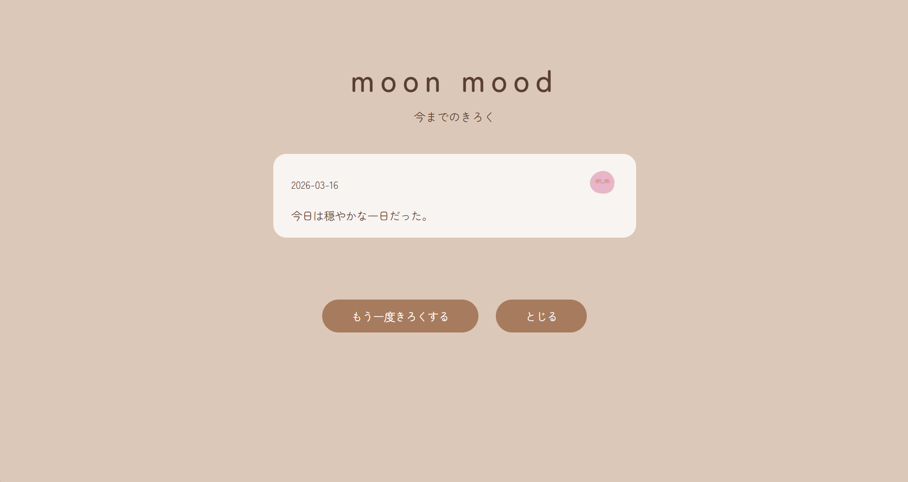

# moon mood

## 概要
日々の気分を手軽に記録し、あとから振り返ることができるWebアプリケーションです。ユーザーは気分アイコンとコメントを登録することで、
その日の状態を可視化できます。シンプルな操作で継続して利用できるように設計しており、一覧画面から過去の記録を確認することが可能です。

## 画面イメージ

### ログイン画面

### 投稿画面

### 投稿完了画面

### 一覧画面

## 使用技術
・Java（Servlet/JSP）
・HTML / CSS / JavaScript
・MySQL　　

## 主な機能
・気分とコメントの登録機能
・一覧表示機能
・データの保存機能
・保存したデータの削除機能　　

## 工夫した点
・シンプルで使いやすい画面設計を意識しました 
・データの保存や表示の流れを理解しながら実装しました
・自作の気分アイコンを表示させてシンプルながら親しみのあるデザインを意識しました。　　

## 今後の改善点
・ユーザー認証機能(パスワード、ID)の実装
・投稿内容の編集機能の追加
・気分の推移を可視化するグラフ昨日の実装
・ログイン後に「記録」または「一覧表示」を選択できる導線の設計　　

・データの保存や表示の流れを理解しながら実装しました
・自作の気分アイコンを表示してシンプルながら親しみにあるデザインにしました。
